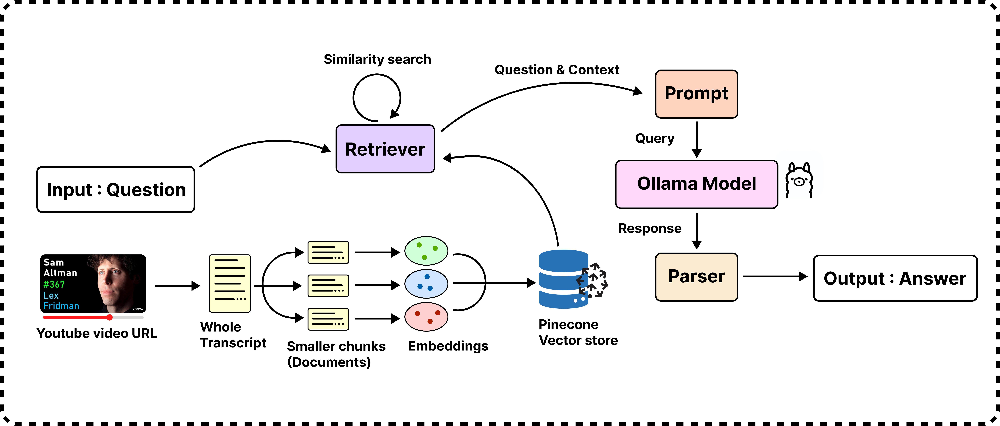

# rag-llama3_1-youtube-qna-app

A powerful Retrieval-Augmented Generation (RAG) application built from scratch using Langchain, Ollama, and Pinecone. 

This app allows users to interact with any YouTube video (even those over 3 hours long) by asking questions and receiving answers.

## RAG Architecture

Below is an overview of the RAG architecture used in this project.

## Upcoming Features...

I’m currently working on turning this application into a RESTful API, making it easier to integrate with other services and platforms.

🚧🏗️👷 In the process of developing...
